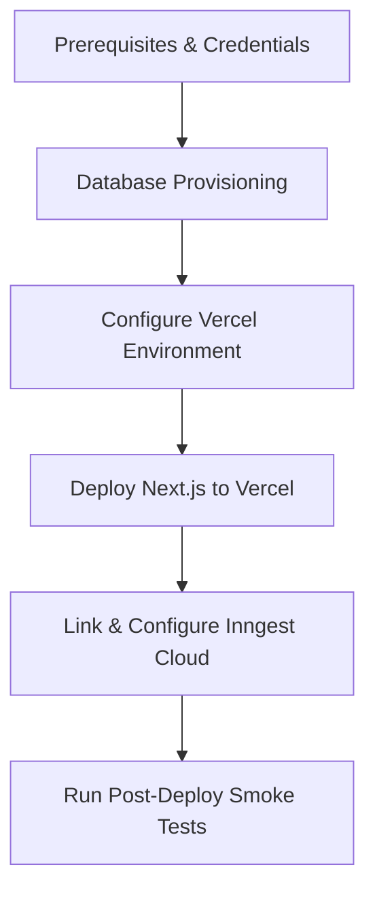

# Pulse AI — Production Launch Runbook

This document serves as the operational guide for deploying, maintaining, and troubleshooting the Pulse AI platform in production. Follow these procedures to guarantee system uptime, reliability, and security.

---

## 1. Production Deployment Sequence

Deploying Pulse AI requires coordinates across Vercel (Next.js hosting), Supabase (PostgreSQL), and Inngest Cloud (background tasks).



### Execution Steps:
1. **Infrastructure Provisioning**:
   * Deploy PostgreSQL on Supabase in the primary target region.
   * Obtain the connection string (with transaction pooling enabled if possible).
2. **Environment Configuration**:
   * Populate Vercel environment variables with keys listed in **Section 2**.
3. **Database Migration**:
   * Run the Prisma production migration command from your local terminal or CI/CD runner (see **Section 4**).
4. **Deploy Application**:
   * Trigger the production branch deploy on Vercel.
5. **Inngest Sync**:
   * Log into Inngest Cloud, add your app endpoint: `https://[production-domain]/api/inngest`.
   * Copy the `INNGEST_SIGNING_KEY` generated by Inngest Cloud, and save it in your Vercel Environment variables. Redeploy if necessary.

---

## 2. Environment Variables Checklist

Ensure the following variables are configured in the production environment settings:

| Variable Name | Required | Security Tag | Description |
| :--- | :--- | :--- | :--- |
| `DATABASE_URL` | Yes | Secret | PostgreSQL connection string. Specify `?connection_limit=20`. |
| `NEXTAUTH_SECRET` | Yes | Secret | Random 32-character base64 string for token encrypting. |
| `NEXTAUTH_URL` | Yes | Public | Base domain URL of the production web application. |
| `NEXT_PUBLIC_APP_URL` | Yes | Public | Mirror of `NEXTAUTH_URL` for background worker callback triggers. |
| `WHATSAPP_ACCESS_TOKEN` | Yes | Secret | Permanent System User Token from Meta Business WABA. |
| `WHATSAPP_PHONE_NUMBER_ID` | Yes | Secret | Verified WhatsApp phone registration identifier. |
| `WHATSAPP_VERIFY_TOKEN` | Yes | Secret | Random key configured for incoming webhook validation. |
| `WHATSAPP_APP_SECRET` | Yes | Secret | Meta application secret key for webhook payload signatures. |
| `GEMINI_API_KEY` | Yes | Secret | Google generative AI key. |

---

## 3. Meta Production Migration Checklist

Follow these steps to transition from Meta Developer Sandbox to a live verified phone number:

1. **Clean Phone Number**: Confirm the number has no active accounts on personal WhatsApp/WhatsApp Business mobile applications.
2. **Business Manager Verification**: Verify your business legal status in Meta Business Suite settings.
3. **API Activation**: Go to the Meta Developer Portal, select your app, add the WhatsApp product, and verify the phone number.
4. **Permanent Token**:
   * Go to **Business Settings > System Users**.
   * Create a new System User with the **Admin** role, link it to your App/WABA, and generate a token with `whatsapp_business_messaging` scope.
5. **Webhooks Setup**:
   * Callback URL: `https://[production-domain]/api/whatsapp/webhook`
   * Subscription fields: `messages`.
   * Set `WHATSAPP_APP_SECRET` to verify payload signature headers.

---

## 4. Database Migration Procedure

Always use migrations when updating database schemas. Do not use `npx prisma db push` in production.

### Execution Command:
Run the deployment migration tool from your local console:
```bash
# Verify schema syntax before running
npx prisma validate

# Deploy migrations to the production PostgreSQL instance
DATABASE_URL="[production_connection_string]" npx prisma migrate deploy
```

---

## 5. Rollback Procedure

If the release causes regressions, follow these rollback runbooks immediately:

### Code Rollback
1. Identify the last working Git commit in history.
2. Revert the production branch to the stable commit:
   ```bash
   git checkout main
   git revert [failed_commit_sha]
   git push origin main
   ```
3. Vercel will rebuild and deploy the stable revision.

### Database Migration Rollback
If the database schema must be rolled back:
1. Access the target database, identify the failed migration filename inside the `_prisma_migrations` table.
2. Force-resolve the migration state to rolled back:
   ```bash
   npx prisma migrate resolve --rolled-back [failed_migration_name]
   ```
3. Deploy the database schema from the last stable codebase to restore standard tables.

---

## 6. Post-Deployment Smoke Tests

Execute these verification tasks immediately following a production deployment:

1. **Verify Environment Configuration**:
   Run the CLI validation check:
   ```bash
   npm run production-check
   ```
   *Expected Outcome*: Report outputs **PASS** status. No launch-blocking errors flag.
2. **Ping Webhooks Endpoint**:
   Perform a diagnostic request to verification callbacks:
   ```bash
   curl -I "https://[production-domain]/api/whatsapp/webhook?hub.mode=subscribe&hub.challenge=1234&hub.verify_token=[your_verify_token]"
   ```
   *Expected Outcome*: Returns HTTP `200` with response body `1234`.
3. **Verify Admin Dashboard**:
   Authenticate as an Admin, navigate to `/admin`, and verify that the **System Health Score** is populated and reporting values.

---

## 7. First Beta User Onboarding Checklist

Execute these validation actions when onboarding a new beta user:

- [ ] **Onboarding Form**: The user signs in via Google, registers their WhatsApp number in international format, and sets interests.
- [ ] **Welcome Message**: The system dispatches a verification message to the user's mobile device via WhatsApp.
- [ ] **Number Verification**: The user clicks verification link or inputs confirmation code. Status updates to `whatsappVerified = true`.
- [ ] **Feed Dashboard**: The user is redirected to `/feed`, displaying custom news matches matching their tags.
- [ ] **Mock Test Digest**: Admin triggers a test scheduled digest to verify WhatsApp layouts render correctly.

---

## 8. Incident Response Checklist

When health score status lights trigger warning states, execute the following runbooks:

### 1. Database Latency Warnings
* **Diagnostic**: DB health score drops < 70 (latency > 300ms).
* **Fix**:
  1. Inspect Supabase console for connection saturation.
  2. Verify Prisma connection limit configuration inside `DATABASE_URL` (`?connection_limit=20` or lower).

### 2. WhatsApp Delivery Failures (DLQ Backlog)
* **Diagnostic**: Deliveries report FAILED status inside the Queue tab.
* **Fix**:
  1. Go to the Admin dashboard `Queue Monitor` tab, inspect the error message details.
  2. If the access token is rejected, generate a new Meta Permanent token and configure Vercel env.
  3. Reset state and retry the job by clicking **"Retry Delivery"**.

### 3. Gemini Rate Limit / Quota Exceeded (429 Errors)
* **Diagnostic**: Gemini API health score drops, and system logs show `Resource Exhausted`.
* **Fix**:
  1. Go to the Admin operations panel and toggle the Global Scheduler to **PAUSED**.
  2. Reduce the ingestion batch size by updating `gemini_batch_size` system setting to a lower value (e.g. `5` instead of `10`) to slow sync speeds.
  3. Resume the scheduler once limits clear.

---

## 9. Daily Operational Checklist

Perform these checks once daily:
* [ ] Open `/admin` dashboard, check the **Platform Health Score** (must report > 90%).
* [ ] Verify the **Scheduler Heartbeat** log timestamp (last logged check must be < 70 mins ago).
* [ ] Open the **Queue Monitor (DLQ)** tab, verify that failed article and delivery lists are empty. Reprocess or reject pending failed tasks.
* [ ] Review Gemini API usage and cost estimations.

---

## 10. Weekly Maintenance Checklist

Perform these tasks every week:
* [ ] **Database JSON Export**: Go to `/admin > Operations Controls`, click **"Export Database JSON"**, and download the database snapshot file to secure offsite storage.
* [ ] **Prune Stale Logs**: Execute database pruning script to delete warning and info log records older than 14 days.
* [ ] **Source Feeds Audit**: Verify all active RSS sources have processed successfully in the last 24 hours. Disable broken or stale feeds.
